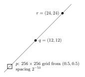
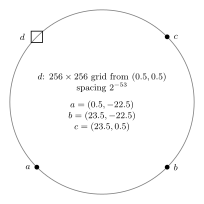

# RobustPredicates in Swift

Yet another implementation of [Shewchuk's Fast Robust Predicates in Computational Geometry](https://www.cs.cmu.edu/~quake/robust.html). The original `C` code may be found [here](https://www.cs.cmu.edu/afs/cs/project/quake/public/code/predicates.c).

These were pulled out of my [Surfaces in Space app on the App Store](https://apps.apple.com/us/app/surfaces-in-space/id6757165264), and packaged in a Swift Package for sharing with others. I worked with Claude (Opus 5.5 fwiw) here primarily to fill out the package's test suite; in Surfaces in Space, these robust predicates are used for the app's custom quad-edge implementation, and the test suite looks a bit different. These work extremely well for my purposes, and I hope you might find them useful for yours as well.

I will continue adding more to this Readme as the package itself fills out. In the meantime if you do source this package, give the DocC generation a go.

## The problem, in pictures
| | Setup | Naive | RobustPredicates |
| :--- | :---: | :---: | :---: |
| `orient2d` |  |  |  |
| `inCircle` |  |  |  |

## Links
- [CMU's Quake Group](https://www.cmu.edu/cee/research/quake/)
- [Adaptive Precision Floating-Point Arithmetic and Fast Robust Geometric Predicates](https://people.eecs.berkeley.edu/~jrs/papers/robustr.pdf)
- [Original `C` code](https://www.cs.cmu.edu/afs/cs/project/quake/public/code/predicates.c), redundantly linked again from the first paragraph. It is public domain.
